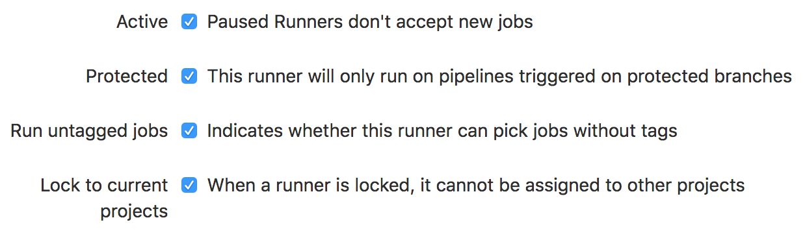

# Continuous deployment for the IDR Kubernetes analysis platform

Setup GitLab continuous deployment for IDR K8s analysis.


## Create a `CI/CD for external repo` project on GitLab

https://docs.gitlab.com/ee/ci/ci_cd_for_external_repos/github_integration.html

All configuration and code changes should be done in the GitHub repository.
The GitLab repository is purely a mirror for integration with CI/CD.


## Create a namespace, role, account and additional token for the Gitlab runner

https://kubernetes.io/docs/admin/service-accounts-admin/

    kubectl apply -f ./k8s-clusterrole/

This will give the GitLab runner almost full administrative access to the cluster.


## Install GitLab runner

https://docs.gitlab.com/ee/install/kubernetes/gitlab_runner_chart.html#installing-gitlab-runner-using-the-helm-chart

Go to the `Runners settings` tab under https://gitlab.com/USERNAME/REPOSITORY/settings/ci_cd.
Get the Runner registration token from and set `runnerRegistrationToken` in gitlab-runner/helm-config.yaml to this value.
The gitlab runner requires additional configuration that is not supported by the chart so at present you must [checkout a fork/PR](https://gitlab.com/charts/charts.gitlab.io/merge_requests/120):

    git clone --branch runner-environment https://gitlab.com/manics/charts.gitlab.io.git
    helm install --namespace gitlab --name gitlab-runner charts.gitlab.io/charts/gitlab-runner/ -f gitlab-runner/helm-config.yaml

If the upstream chart is updated and released installation will be simpler:

    helm repo add gitlab https://charts.gitlab.io
    helm install --namespace gitlab --name gitlab-runner gitlab/gitlab-runner -f gitlab-runner/helm-config.yaml

This repo is used for deployments so shared GitLab runners cannot be used, irrespective of whether they are public or inside the group.
Ensure you `Disable shared Runners`.

**WARNING**: GitLab allows you to share runners across multiple projects.
Ensure it is disabled since this runner has administrative permissions to manage the deployments so only fully trusted scripts should be run.




## Configure secret variables for the deployment

Setup Secret variables referenced in [`.gitlab-ci.yml`](.gitlab-ci.yml).
These should be visible to `All environments`.
- `SECRET_JUPYTERHUB_PROXY_TOKEN`
- `SECRET_IDR_PASSWORD`
- `SECRET_GITHUB_CLIENTID`
- `SECRET_GITHUB_CLIENTSECRET`
- `SECRET_AAI_CLIENTID`
- `SECRET_AAI_CLIENTSECRET`
- `SECRET_GRAFANA_GITHUB_CLIENTID`
- `SECRET_GRAFANA_GITHUB_SECRET`
- `SECRET_PROMETHEUS_AUTH_HTPASSWD`


In future we may move to manually creating Kubernetes secrets in advance if supported by the corresponding Helm charts, for example https://github.com/kubernetes/charts/pull/5435


## Additional notes

If you are using a mirrored repository prevent changes to the GitLab repository by protecting the `master` branch under https://gitlab.com/USERNAME/REPOSITORY/settings/ci_cd and setting `No one` allowed to merge or push.

You can add details of the Kubernetes cluster to Gitlab to get additional integration: https://gitlab.com/help/user/project/clusters/index#adding-an-existing-kubernetes-cluster.
However this didn't work for me.


### Known issues

If you see an error along the lines of
```
Error: UPGRADE FAILED: render error in
"jupyterhub/templates/proxy/deployment.yaml": template:
jupyterhub/templates/proxy/deployment.yaml:17:32: executing
"jupyterhub/templates/proxy/deployment.yaml" at <include (print $.Tem...>: error
calling include: template: jupyterhub/templates/hub/secret.yaml:7:19: executing
"jupyterhub/templates/hub/secret.yaml" at <required "Proxy toke...>: error
calling required: Proxy token must be a 32 byte random string generated with
`openssl rand -hex 32`! err: exit status 1 ERROR: Job failed: error executing
remote command: command terminated with non-zero exit code: Error executing in
Docker Container: 1
```
This may be a race condition.
Retry the job.
